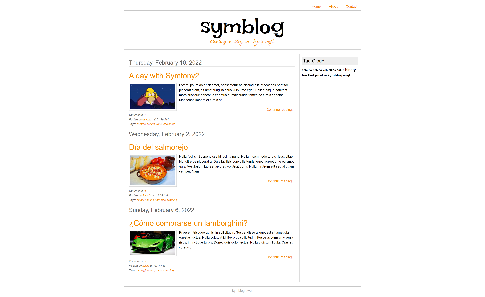
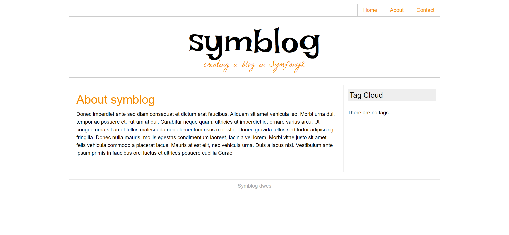
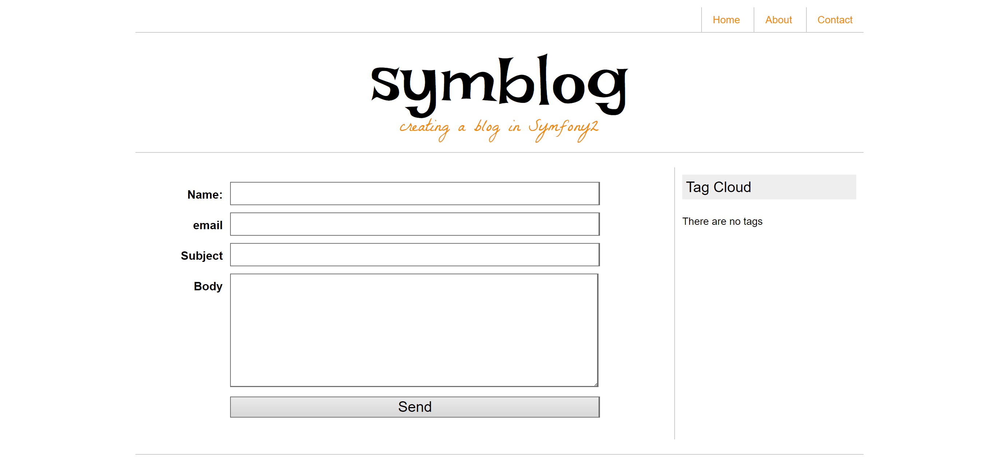

# Symblog

## Redirección 
127.0.0.1 blogMVC.local

## VirtualHost
    <VirtualHost *>
        DocumentRoot "C:/xampp/htdocs/dws/blog/public/"
        ServerName blogMVC.local 
        <Directory "C:/xampp/htdocs/dws/blog/public/">
            Options All 
            AllowOverride All
            Require all granted
        </Directory>
    </VirtualHost>

## Index

## About

## Contact
